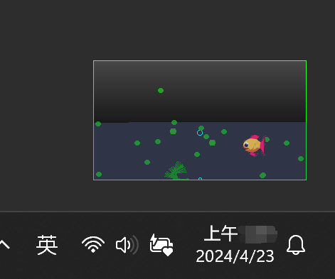

# 赛博小鱼缸

桌面小应用，休闲，小鱼缸

也可以看成是用一种具有观赏性的方式展示电脑性能情况

同时为了提高观赏性，小鱼缸里增加了《疯狂水族馆》里的小古比鱼。

## 注意事项

本项目的所有开发者不对使用本软件的用户承担任何责任。在大学生用自己电脑期末考试时、某些竞赛时使用时，造成的误解和损失请自行承担。

## 参数介绍

小鱼缸宽高：大小和主屏幕同比例，宽度固定 300px

水位线高度：表示剩余内存

水的清澈程度：表示 C 盘剩余容量大小，C 盘空间越小，水越黄

小生物球：每个生物球都是一个 cpu 内核。当某个核使用率不是 0%的时候，会变黄，使用率越高，半径越大，移动速度越快。

小鱼缸顶部光线：表示当前屏幕的亮度，截图，随机抽 100 个像素决定。平均像素亮度值越高，光线强度越亮。

水面波浪：网络下载速度

气泡柱冒泡频率：网络上传速度

沙子高度：交换内存大小

沙子表层污垢高度：使用了的交换内存大小

地震波：磁盘 IO，扩散波表示写入速度，收缩波表示读取速度

## 设计草稿

https://www.figma.com/file/AJAs3WzQTwpwTTEZR5hjdu/%E8%B5%9B%E5%8D%9A%E7%94%9F%E6%80%81%E7%BC%B8

## [贡献指南](doc/CONTRIBUTING.md)
